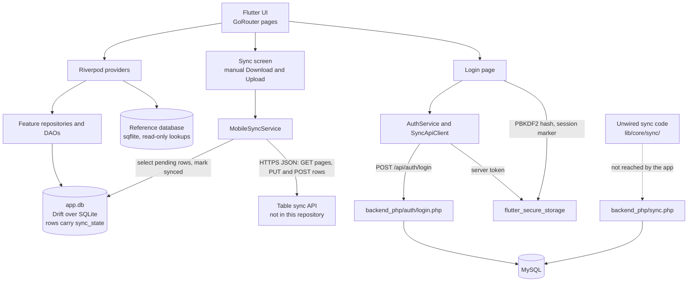
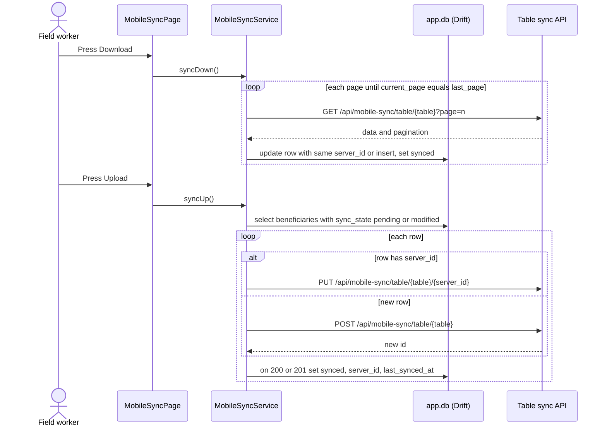

# Architecture

This document describes how the app is built, based on the code in this repository. Paths are relative to the repository root. Where the code contains more than one implementation of something, only the one the running app reaches is described as the architecture; the others are listed as not wired.

## 1. Overview

A Flutter app for field staff who register families, record home visits, attach photos and documents, manage partner associations and sponsorships, and produce PDF/Excel reports. Staff often work without a connection, so screens read and write a local SQLite database, and recording families, visits and attachments does not need the network. A separate read-only reference database, downloaded once, is used to look people up. Field records leave the device only when a user opens the sync screen and presses Upload. The repository also contains a PHP/MySQL API (`backend_php/`) that the app uses for sign-in.

## 2. High-level diagram



## 3. Code layout

```text
lib/
  main.dart, main_release.dart   entry points; main_release.dart also initialises Sentry
  app.dart                       MaterialApp.router, theming, Arabic locale
  routing/app_router.dart        GoRouter routes and the sign-in redirect
  core/
    providers/providers.dart     root providers: AppDatabase, ApiClient, AppConfig
    sync/                        live MobileSyncService plus unwired sync code (section 5)
    storage/                     two flutter_secure_storage wrappers
    services/                    password hashing, database maintenance, PDF/Excel export
    network/, config/            Dio clients, endpoint and config constants
    ...                          design system, widgets, error handling, utilities
  data/
    db/                          Drift database (drift_database.dart), tables/, daos/
    api/sync_api_client.dart     Dio client used for sign-in
    services/auth_service.dart   login and logout against the PHP API
    dto/, models/                JSON DTOs and plain models
  features/                      one folder per feature, mostly data/domain/presentation
    beneficiaries/               family registration form, list, details
    visits/                      home visits
    attachments/                 photos and documents per family
    associations/, kafalat/      partner associations; sponsorships and their Excel import
    dashboard/, reports/         dashboard; PDF and Excel reports
    search/                      person lookup in the reference database
    sync/                        the sync screen
    auth/, initialization/       login page; first-run check for the reference database
  l10n/                          ARB files (ar, en) and generated localisations
backend_php/                     PHP API: auth/, sync.php, config.php, SQL schema
test/, integration_test/         tests
```

The remaining feature folders hold the reference-database download flow and a few debug, example or unrouted pages.

## 4. Data layer

**Local database.** `AppDatabase` in `lib/data/db/drift_database.dart` is a Drift database stored as `app.db` in the app documents directory. It is opened with `NativeDatabase.createInBackground` and sets `foreign_keys = ON`, `journal_mode = WAL` and `synchronous = NORMAL`. One instance is exposed through `databaseProvider` in `lib/core/providers/providers.dart`.

It registers 12 Drift tables (`lib/data/db/tables/`) and 11 DAOs (`lib/data/db/daos/`):

| Group | Tables |
|---|---|
| Families | `beneficiaries`, `family_members`, `family_deceased` |
| Field work | `visits`, `attachments` (metadata; the files live on disk), `activities` (local activity log) |
| Sponsorships | `associations`, `association_representatives`, `sponsorships` |
| Lookups | `taxonomies` (grouped code lists such as categories and governorates) |
| Sync bookkeeping | `sync_queue`, `sync_metadata_table` (only the unwired sync code uses these) |

A 13th table, `import_batches`, is created with raw SQL to audit Excel imports of sponsorships.

Most domain tables carry `sync_state` (text, default `pending`), and most also carry `server_id` and `last_synced_at`. Repositories set `sync_state` to `pending` on create and update, for example `lib/features/beneficiaries/data/repositories/beneficiary_repository_impl.dart`.

**Schema and migrations.** `schemaVersion` is 16. `onCreate` creates all tables, the `import_batches` table, performance indexes and two triggers that keep a lower-cased `full_name_norm` column current for name search. `onUpgrade` runs incremental `if (from < N)` steps for versions 12 to 16 (sponsorships table, `import_batches`, then new sponsorship columns) and re-creates the indexes. Two seconds after startup, `DatabaseMaintenanceService` (`lib/core/services/database_maintenance_service.dart`) runs `VACUUM` and `ANALYZE` when their intervals have passed.

**Reference database.** A read-only reference database used for lookups. It is a separate SQLite file opened with `sqflite`, not Drift (`lib/features/search/data/datasources/`). The app uses it for lookups and never adds or deletes its records. It does add indexes on open, and a maintenance screen (`/update-normalization`) can fill in a normalised-name column. It is downloaded over HTTP as a ZIP archive and extracted on the device. At startup, `/app-init` (`lib/features/initialization/presentation/pages/app_initialization_page.dart`) checks that the file exists and sends the user to the download page if it does not. Name search normalises Arabic spelling variants (`lib/features/search/data/datasources/text_normalization_service.dart`).

## 5. Sync

### Live path

The only sync code the running app reaches is `MobileSyncService` in `lib/core/sync/mobile_sync_service.dart`. `mobileSyncServiceProvider` (`lib/features/sync/mobile_sync_page.dart`) creates it, and `MobileSyncPage` is mounted at `/sync` and `/mobile-sync` in `lib/routing/app_router.dart` and as the second tab of the dashboard.

1. **Change tracking.** There is no outbox. A row counts as changed when its `sync_state` is `pending` (upload also accepts `modified`).
2. **Download (`syncDown`).** Requests `GET /api/mobile-sync/table/{table}` page by page (`per_page=100`, ordered by `id`) until a page is empty or `current_page == last_page`. `BeneficiaryMapper.fromBackend` (`lib/core/mappers/beneficiary_sync_mapper.dart`) maps each record. The service updates the local row with the same `server_id`, or inserts a new one, and marks it `synced`. A record that fails to map is logged and skipped. Every download fetches the whole table; there is no "since" marker.
3. **Upload (`syncUp`).** Selects beneficiaries whose `sync_state` is `pending` or `modified`. A row with a `server_id` is sent as `PUT .../{server_id}`; a row without one is sent as `POST`, and the returned `id` is stored as `server_id`. On success (HTTP 200 for PUT, 200 or 201 for POST) the row is set to `synced` with `last_synced_at`. A failed row keeps its state and is sent again on the next upload.
4. **Transport.** The service builds its own Dio client with 30-second connect and receive timeouts and JSON headers.
5. **Progress.** A broadcast stream of `MobileSyncStatus` drives the progress bar and status text on the page.

Sync runs only when a user presses Download or Upload. The dashboard listens to `connectivity_plus`, but only to show an online indicator and refresh its own data; it does not start a sync.



### Legacy / not wired

The following exist in the codebase, but no code path from `lib/main.dart` reaches them:

- `lib/core/sync/sync_manager.dart`: `SyncManager`, a priority `sync_queue` and a 5-minute timer. It is referenced only from `lib/features/sync/sync_widgets.dart`, `test_sync_page.dart`, `presentation/providers/sync_activity_providers.dart` and `domain/usecases/sync_with_activity.dart`, and live code imports none of them.
- `lib/core/sync/new_sync_manager.dart`: imported nowhere. It speaks the `backend_php/sync.php` protocol through `SyncApiClient.syncData`.
- `lib/core/sync/background_sync_worker.dart`: `initialize()` returns immediately, and `workmanager` is commented out in `pubspec.yaml`.
- `lib/core/sync/conflict_resolver.dart`: `ConflictStrategy { serverWins, localWins, newerWins, askUser }`. Only tests use it.
- `lib/core/sync/sync_queue.dart`: imported nowhere.
- `lib/core/sync/data/`, `domain/`, `presentation/`: a clean-architecture sync repository and use cases. `lib/main.dart` overrides two of their providers, but no widget reads them.
- `lib/core/network/api_client.dart`: chunked attachment upload methods (`/attachments/init`, `/chunk`, `/commit`) that nothing calls. The 512 KB `attachmentChunkSize` in `lib/core/config/app_config.dart` is never read.

## 6. Authentication

**Online sign-in.** `LoginPage` (`lib/features/auth/login_page.dart`) calls `AuthService.login` (`lib/data/services/auth_service.dart`), which posts to `/api/auth/login` through `SyncApiClient`. The PHP login endpoint in this repository returns an opaque bearer token (32 random bytes, hex-encoded; not a JWT), and `SecureStorage.saveAuthData` stores it.

**Offline sign-in.** After an online sign-in succeeds, the page stores a PBKDF2-HMAC-SHA256 hash of the password with `SecureStore.saveOfflineLoginHash`. `PasswordHashService` (`lib/core/services/password_hash_service.dart`) uses a 16-byte random salt, a 32-byte key and 10,000 iterations. If a later sign-in fails with a network error (`AuthResult.isNetworkError`; `SyncApiClient.login` maps every Dio exception to `NETWORK_ERROR`), the page checks the password against the stored hash in constant time. The first sign-in on a device needs the server, and only one username/hash pair is kept per device.

**Session.** Both paths finish with `SecureStore.saveCredentials`, which writes a local placeholder token. The GoRouter redirect reads it through `SecureStore.isAuthenticated`.

**Secret storage.** `lib/core/storage/secure_store.dart` and `lib/core/storage/secure_storage.dart` both wrap `flutter_secure_storage`, using EncryptedSharedPreferences on Android and the Keychain (`first_unlock`) on iOS.

**Logging.** In debug builds, `SyncApiClient` logs requests without headers or bodies.

## 7. Navigation and state

**Routing.** `appRouterProvider` (`lib/routing/app_router.dart`) builds a `GoRouter` with a flat route list and `initialLocation: '/app-init'`. Its redirect lets the start-up and download routes through, sends unauthenticated users to `/login`, and sends authenticated users away from `/login`. Four developer test routes are registered only under `kDebugMode`.

**State.** State management is Riverpod 2 without code generation: `Provider`, `FutureProvider`, `StreamProvider` and `StateNotifierProvider`. Feature folders declare their own `databaseProvider` placeholders, and `lib/main.dart` overrides them in `ProviderScope` with the single root `AppDatabase`. Several features use data/domain/presentation layers with repositories and use cases, but not all do; some pages query Drift directly, such as `lib/features/sync/mobile_sync_page.dart`.

**Locale.** The UI runs in a fixed Arabic locale (`app.dart`), with English ARB strings also present.

## 8. Backend (`backend_php/`)

Plain PHP files with `mysqli` prepared statements. `config.php` reads secrets from environment variables or an untracked `config.local.php` (a template is included), sets JSON and security headers, and provides `verifyToken()`. That function hashes the bearer token with HMAC-SHA256 and matches it against `users.token` with a 24-hour expiry.

| File | Purpose |
|---|---|
| `auth/login.php` | Checks email and password with `password_verify`. Locks out after 5 failures in 15 minutes per email or IP. Issues an opaque token and stores only its hash. |
| `auth/logout.php` | Clears the stored token. |
| `sync.php` | Two-way sync for beneficiaries, visits, attachments (metadata only), family members and deceased relatives. Requires a bearer token. |
| `test.php` | Health check. |
| `sync_family_updated.php` | Variant for the family tables with integer enums. It requires `config/database.php`, which is not in the repository. |
| `database_setup.sql`, `migrations/` | MySQL schema: users, login attempts, activity and sync history, tombstones, and domain tables with `updated_at` timestamps. |

How `sync.php` applies a request `{lastSyncTime, pendingChanges[], deviceInfo}`:

1. It opens one transaction.
2. For each change `{entityType, entityId, operation, data}`, a `create` or `update` becomes `INSERT ... ON DUPLICATE KEY UPDATE` keyed by the client's id, with the server setting `updated_at = NOW()`, so the last write wins. A `delete` removes the row and writes a tombstone to `deleted_entities`.
3. A change that throws is added to `failedChanges` (marked retryable), and the rest still commit.
4. It returns rows with `updated_at > lastSyncTime` (up to 100 per entity, with no continuation cursor), tombstones since that time and a `serverTimestamp`. It also records the request in `sync_history`.

There is no file-upload endpoint. The live app uses only `auth/login.php`. `sync.php` matches the unwired `SyncApiClient.syncData`, and the table API that `MobileSyncService` calls is not part of this repository. The client posts to `/api/auth/login` without the `.php` extension, and the repository contains no rewrite configuration for that path.

## 9. Testing and CI

`find test -name '*_test.dart' | wc -l` returns 53. Of those, 27 contain widget tests (`testWidgets`) and 26 are plain unit tests. Ten files run against an in-memory Drift database (`NativeDatabase.memory()`): nine widget tests and the DAO test in `test/data/db/daos/`. Performance-focused tests are in `test/performance/` and `test/features/search/performance/`. Four more test files are disabled with a `.skip` suffix, and `integration_test/` holds one file that CI does not run. The sync tests in `test/core/sync/` cover `background_sync_worker` and `conflict_resolver`, which are both unwired; nothing tests `MobileSyncService`.

`.github/workflows/flutter_ci.yml` runs on pushes and pull requests to `main` and `develop`:

1. **analyze-and-test:** `dart format --set-exit-if-changed` (non-blocking), `flutter analyze --no-fatal-infos`, `flutter test --coverage`, and a Codecov upload (non-blocking).
2. **build-android:** builds a debug APK, then a release APK with `--obfuscate --split-debug-info`, and uploads both APKs and the symbols as artifacts.
3. **build-ios:** `flutter build ios --release --no-codesign` on macOS, with `continue-on-error: true`, so a failure does not fail the run.
4. **code-quality:** counts TODOs and files; informational only.
5. **deploy:** on pushes to `main` only, sends the release APK to Firebase App Distribution.

A second workflow, `android_fastlane_firebase.yml`, also distributes to Firebase through Fastlane on pushes to `main`.

## 10. Known limitations

- Sync covers beneficiaries only. Visits, attachments, family members, associations and sponsorships are marked `pending`, but nothing uploads them.
- Sync is manual. There is no background, periodic or connectivity-triggered sync.
- Every download fetches the full table.
- There is no conflict detection. A download overwrites any local row with the same `server_id` and marks it `synced`, so unsent local edits to that row are lost if a user downloads before uploading.
- Deleting a beneficiary removes the local row outright, and no deletion is ever sent to the server.
- The table sync API that the app calls is not in this repository.
- Several parallel sync implementations and unused client code remain in `lib/core/sync/` and `lib/core/network/`.
- CI and Fastlane build from `lib/main.dart`, where Sentry initialisation is commented out. `lib/main_release.dart`, the entry point with Sentry, is not used by any build script in the repository.
- Startup maintenance in `lib/main.dart` creates its own `ProviderContainer`, which opens a second `AppDatabase` connection to the same file.
